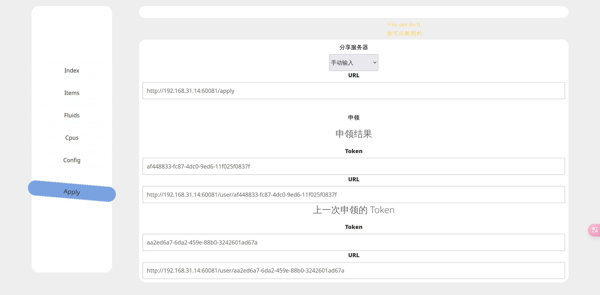
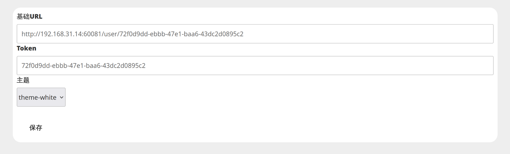
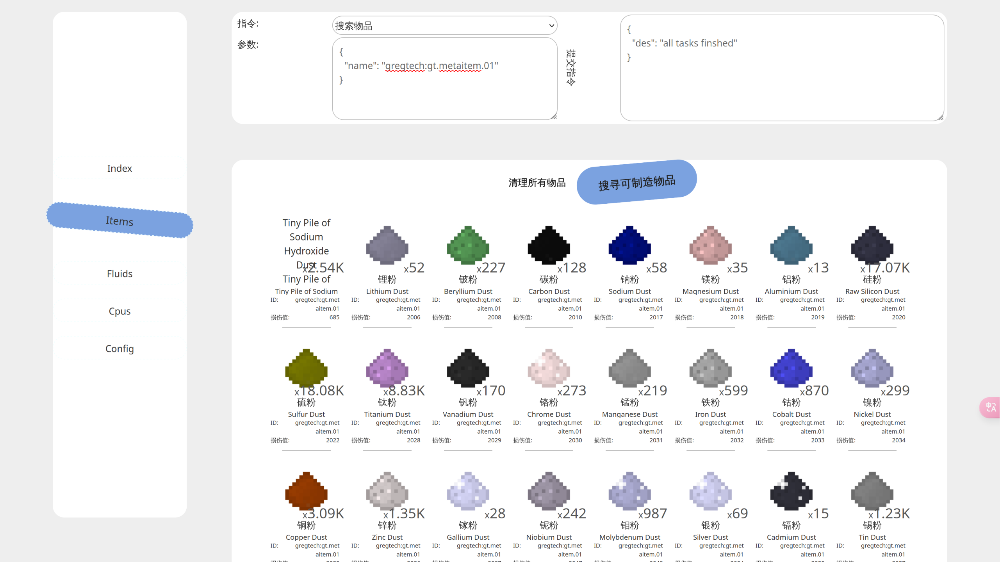
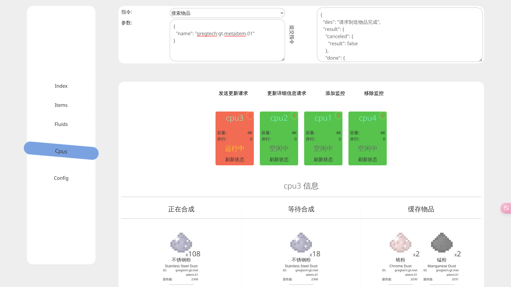

# OC-AE

该程序能够在 GTNH 原版包中实现网页端控制AE网络中物品的合成以及查看网络中的物品和流体。

目前实现的功能有：

* 搜寻网络中的物品
* 获取网络中所有流体
* 获取网络中所有源质
* 获取网络中所有 CPU 信息
* 请求网络制作指定物品
* 监控 CPU 工作状态直至 CPU 空闲

### 仓库目录结构

* `oc`: 为oc程序
* `front`: 为前端控制面板
* `backend`: 为后端

### 如何使用

在游戏中需要运行着 [oc](./oc) 程序的机器一台。

可依据自己需求搭建前端页面，也可以进 [在线体验](https://blog.smileyik.eu.org/oc-ae/) 链接，并填入自己的后端地址（若后端有密钥验证则需要输入密钥信息）进行使用。

#### 为OC电脑安装程序

安装程序可选自行复制lua代码至机器中，或者使用安装脚本进行安装，详细见 [oc页面](./oc/README.MD)，安装完后在oc电脑中 edit ./oc-ae/config.lua 中的配置。

#### 搭建后端程序

##### 自己手动搭建

后端程序需要搭建在一台GTNH游戏服务器能够访问到的机器上。详细请到 [backend](./backend) 目录查看。

##### 使用分享服务器

**!!! 请珍惜他人分享的后端服务器，拒绝滥用，合理使用。正是因为他人的无私分享，才能降低各位GTNH员工将自己的AE网络接入互联网的成本！ !!!**

**此外，非常感谢那些分享服务器的员工！**

如果你不想自己搭建一个自己的后端，可以进 [在线体验](https://blog.smileyik.eu.org/oc-ae/) 网站，进入 `Apply` 页面，申领一个网络空间地址。
可以选择现有的分享服务器，也可以自行输入一个分享服务器，申领成功后会显示出你的后端地址以及验证凭据，如图所示：

请妥善保存申领到的后端地址及验证凭据，之后进入 Config 页面，在 基础URL 框中填入后端地址，Token 栏中填入验证凭据，如图所示：

然后进入游戏中，按照相同的逻辑去修改 config.lua 文件。

若忘记了你申领到的地址和凭据，再次进入 `Apply` 页面中，会显示你上一次获取到的后端地址与验证凭据。

### 效果展示

